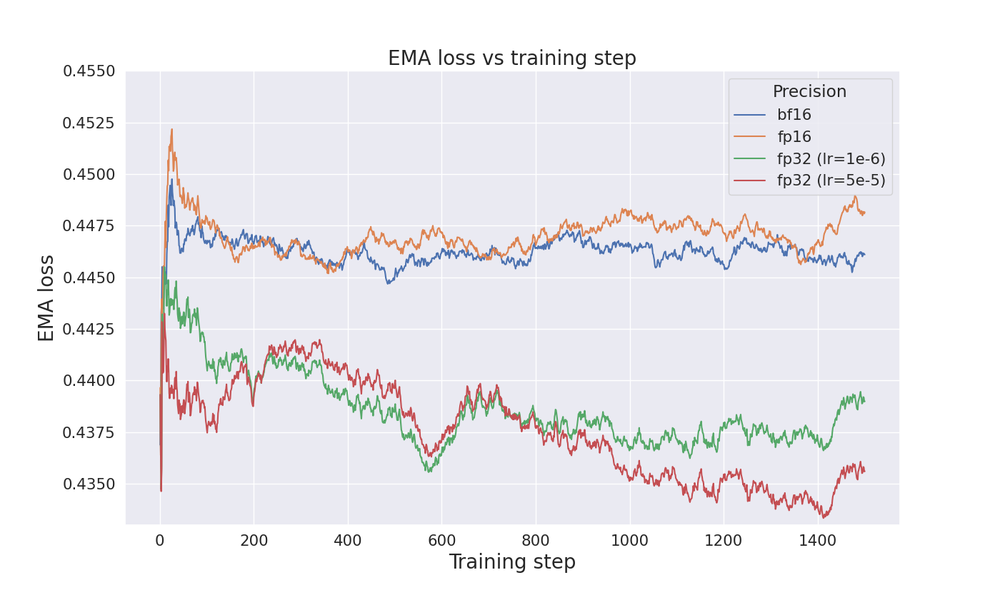

# FLUX PyTorch benchmark

## Prerequisites

* Git
* Docker
* AMD GPU(s) with appropriate drivers set up: tested on AMD's 8xMI300X
* Valid [Hugging Face user access token](https://huggingface.co/docs/hub/en/security-tokens)
* (Optional) [Hugging Face CLI documentation](https://huggingface.co/docs/huggingface_hub/main/en/guides/cli)

## Quick setup

1) Build and launch the docker container:

    ```bash
    make build_and_launch_docker
    ```

2) Navigate inside the docker using:

    ```bash
    make exec_docker
    ```

3) Download the necessary assets: 

    ```bash
    make download_assets
    ```

4) Launch the benchmarking script:

    ```bash
    python launcher.py
    ```


## Detailed environment setup

### Configuring environment variables with `.env` file

The scripts in this project automatically load values from the `.env` file (git-ignored).
If the `.env` file is not present, they will use `.env.example` as a fallback.
To use the default settings, you can copy `.env.example` to `.env` using:

```bash
cp .env.example .env
```

By default, the `.env` file contains the following settings (edit these as needed):

```bash
VOLUME_MOUNT=~/.cache/huggingface:/workspace/huggingface
CONTAINER_NAME=flux-pytorch
IMAGE_NAME=flux-pytorch
```

### Building and launching the Docker image

To build and launch the Docker container, use the following Makefile target (in the **repository root**):

```bash  
make build_and_launch_docker  
```

* By default, the Docker launch will create a local directory `~/.cache/huggingface` (Hugging Face's default local cache dir) it doesn't previously exist (e.g. if Hugging Face cli is not installed).

* It's possible to dynamically override `.env` defaults when running a make script by explicitly setting them.
  Note that variables *must* come after the target so that `.env` won't overwrite them. 
  For example:

  ```bash
  make build_and_launch_docker \
    CONTAINER_NAME=my_container \
    IMAGE_NAME=my_image \
    VOLUME_MOUNT="/my_local_mount/:/my_docker_mount"
  ```

  will build and launch docker image `my_image` as a container named `my_container` with mount `/my_local_mount/:/my_docker_mount`.


### Launching a prebuilt Docker image

Launching a Docker container from a prebuilt image can be done with:

```bash
make launch_docker
```

### Executing shell inside a Docker container

To navigate inside a running Docker container, use the `exec_docker` target:

```bash
make exec_docker
```

This will open a shell inside the container specified by `CONTAINER_NAME` above.

### Downloading the assets

To train the model, the training data and the FLUX model's pretrained checkpoint, which are here referred as assets, need to be downloaded.
We provide a make script for convenience:

```bash
make download_assets
```

* **Becauce of caching (see below) the script only needs to run once!**
* The script can be run either inside a Docker container (preferable) or locally.
Running it locally requires the [Hugging Face CLI](https://huggingface.co/docs/huggingface_hub/main/en/guides/cli) to be installed.
The Docker container already includes this requirement.  
* The script will prompt the user to provide a valid Hugging Face user access token, if not already logged in
* By default, the assets are downloaded to `~/.cache/huggingface`; Hugging Face's default local cache dir (HF cache). 
* The default `VOLUME_MOUNT` configuration synchronizes the local HF cache with that of the Docker container. 
As a result, running `make download_assets` inside Docker saves the assets locally in the same location as described above. 
Conversely, any assets downloaded locally are automatically also available in the Docker container.  

## Running the FLUX.1-dev full-weight training

This project uses Accelerate as the training backend.
Accelerate is a PyTorch library that supports multiple distributed training strategies, including DDP, FSDP, and DeepSpeed.

To train the model, use the following command:

```bash
accelerate launch --config_file=./config/accelerate_fsdp_config.yaml train.py [OPTIONS]
```

**Options:**
* `--batch_size=<int>`: Specifies the batch size for training. Replace <int> with the desired integer value. For example, --batch_size=32.
* `--mixed_precision=<bf16, fp16, no>`: Sets the mixed precision mode. Choose one of the following options:
  * `bf16`: Use bfloat16 precision.
  * `fp16`: Use float16 precision.
  * `no`: Do not use mixed precision.
* Please see `python train.py --help` to view all training parameters.
* Note that the python arguments come *after* `train.py`, as opposed to the `accelerate launch` parameters (e.g. `--config_file`) that come before `train.py`.
* The file `config/accelerate_fsdp_config.yaml` should be provided, or otherwise Accelerate opts to use so-called default configuration.
This configuration uses FSDP across 8 GPUs and disables `torch.compile()`.

### Creating a custom configuration

To create or modify an Accelerate configuration, run:

```bash
accelerate config --config_file path/to/config
```

If a `--config_file` is not specified, the is by default saved in `$HF_HOME/accelerate/default_config.yaml`.

## Benchmark results

The benchmark is based on the `config/accelerate_fsdp_config.yaml` described above.
This configuration uses Fully Sharded Data Parallel (FSDP) across 8x MI300X GPUs.
The frames per second (FPS) for a single GPU using `bf16` precision are shown in the table below.

| Precision | Single GPU FPS (batch size = 1) | Single GPU FPS (optimal batch size) |
| --------- | ------------------------------- | ----------------------------------- |
| bf16      | 2.06                            | 4.48 (batch size = 10)              |

### Reproducing the benchmarks

Reproducing the benchmark results is convenient with `launcher.py`. Run:

```bash
python launcher.py --param_config_file=config/full_benchmark_config.yaml
```

which will automatically sweep the training script through a range of different parameter settings (precisions, batch sizes, etc.)
* The default option `--param_config_file=config/minimal_benchmark_config.yaml` will run a minimal benchmark
* See `python launcher.py --help` to view all launcher parameters.
* The results will by default be stored to `outputs/runs`: one can view them with

  ```bash
  csvlook outputs/runs/sweep_000/runs_summary.csv
  ```

## Training stability and convergence analysis

The *pretrained* FLUX.1-dev model was finetuned using different precision modes on the pseudo camera 10k dataset in order to test training stability and loss convergence. 
It is important to note that we started from a pretrained checkpoint, so radical loss convergence was not expected from the outset.

The training was launched using the following command, varying the precision and learning rate as required.

```bash
accelerate launch --config_file=./config/accelerate_fsdp_config.yaml train.py \
  --num_iterations 1500 \
  --learning_rate 1e-6 \
  --train_batch_size 16 \
  --mixed_precision bf16 \
  --lr_scheduler cosine \
  --lr_warmup_steps 150
```

Full-precision (FP32, `--mixed_precision no`) training was performed with both low (`1e-6`) and high (`5e-5`) learning rates, as FP32’s higher numerical precision accommodates larger learning rates without numerical instability. 
In both cases, the full-precision models showed clear loss convergence, whereas the mixed precision modes did not exhibit a definitive trend toward convergence or divergence. 
The reduced precision in mixed precision training is thought to limit the ability to converge effectively.

<p align="center">
  
</p>

The following images are generated by the original model (left) and the FP32 finetuned model (lr=1e-6, right) using prompt "Bright neon sign in a busy city street, 'Open 24 Hours', bold typography, glowing lights" with a guidance scale of 3.5.

<p align="center">
  
  
</p>
